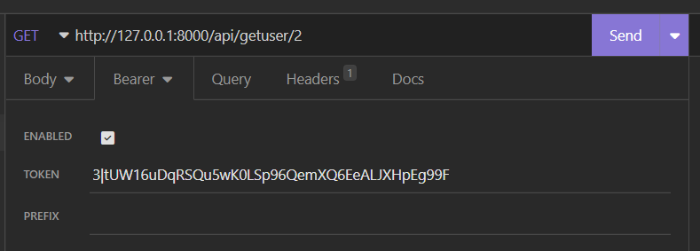

# U06 Receptapp

Denna uppgift handlar om att bygga en receptapp som tillåter användaren att söka på recept och filtera resultat och (VG) spara recept som man gillar i olika listor. Både backend och frontend av applikationen ska deployas och kopplas ihop så att de fungerar tillsammans. 

## Bekanta er:

I denna uppgift ska ni bekanta er med RecipeAPI, ett projekt skrivet i PHP/Laravel. 

Bekanta er genom att läsa igenom koden, få igång programmet med bland annat migrationer, seeding och serving. Testa sedan de olika requesten du får tillgång till genom att importera filen:
"Insomnia_U06_requests.json" till er Insomnia klient. Ni kommer att behöva plocka ut de bearer tokens ni får vid inlogg eller registrering och klistra in i Bearer fältet för att kunna få åtkomst till de API vägar som ligger bakom authentication.

## Bygga Frontend

Ni ska sedan skapa en frontend i Angular (utanför er devcontainer, t.ex. i ett annat VSCode fönster) som ska låta er söka efter och filtrera olika recept med hjälp av ett externt API såsom [edaman API](https://developer.edamam.com/edamam-docs-recipe-api) eller [spoonacular API](https://spoonacular.com/food-api) (ni kommer att behöva registrera er för att få tillgång till API:et).

Ni ska också koppla ihop erat frontend med RecipeAPI backenden. Skapa en sida för den inloggade användaren och tillåt användaren att logga in och logga ut.

## Deployment

När frontenden är färdig ska ni deploya både frontend (på e.g. [netlify](https://www.netlify.com/)) och backend (på e.g. [railway](https://railway.app/)). Väl i produktion ska dessa kopplas ihop så att de fungerar harmoniskt tillsammans. 

## Utöka frontend och backend (VG)

För att få VG på den här uppgiften så ska ni utöka programmet så att användare kan spara recept de gillar i olika listor. T.ex. kanske en användare vill ha en lista för bbq, en för soppor och en lista för vegansk mat. Ni ska då lägga till nödvändiga delar för att åstadkomma detta i backend och frontend inklusive controllers och routes i backend, och extra komponenter, vyer och services i frontend (samt ändringar i tidigare delar där det behövs).

Ännu fler extra detaljer får gärna läggas till i mån av tid och för att helt försäkra sitt VG, t.ex. förbättringar i redan existerande kod, ett snyggt UX/UI samt kopplingar till fler API:er.

## Mer info:

Mer info går att hitta i uppgiftsbeksrivningen i Canvas.

Lycka till!